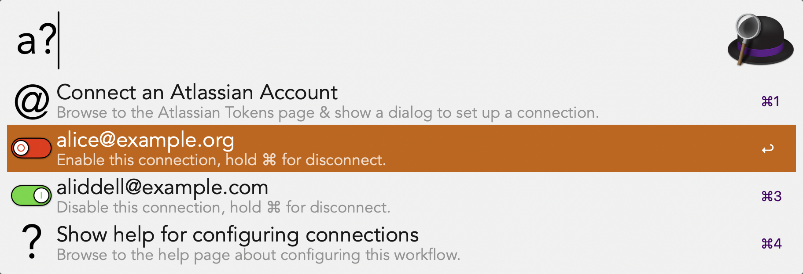

# Configuration

In order to provide federated access to multiple Atlassian Accounts, and to
store the required API tokens in the macOS Keychain, the configuration of
the workflow is done via an Alfred workflow, and not via the User Configuration
in the Alfred settings.

## Important Security Notice

API tokens can be used to perform any action that you can perform on any
site that your Atlassian Account has access to. Some important points to
consider:

1. Although this workflow stores the tokens on the macOS Keychain, the
   nature of the implementation means that an attacker who can execute
   processes on your computer can exfiltrate these tokens.
2. The process of setting up tokens requires copying tokens to and from your
   clipboard. You should disable any clipboard history manager, including
   Alfred's built in one if you use it, _**before**_ you follow this process,
   and re-enable it afterwards.
3. You are trusting this workflow to only perform actions you have requested.
   To help build this trust the workflow source code is available, including
   the tooling used to build it. I will take seriously any advice about
   security related aspects of this workflow. Having said that, this is an
   _at your own risk_ decision by you.

## Connecting an Account

To connect your Atlassian Account, you can use the `a?` keyword:

If you try to use the search keyword `aa` and no accounts have been connected,
the workflow will prompt you to connect an account also:

Actioning either item will commencing the token save flow. Three things will
happen at this point:

1. Your default browser will be used to open the Atlassian Account API
   Tokens management page.
2. A description of the usage, something like _Halfyak Atlassian workflow
   for Alfred, user alice on Alice's Mac_, will be copied to your clipboard.
   This is intended be to be used as a token label.
3. A dialog titled "Connect Atlassian Account " will be presented by the
   workflow.

The intended flow at this point is

1. Click the **Create API Token** button on the Atlassian Account page opened
   by item 1 above.
2. In the **Create an API Token** dialog that is raised in the browser, paste
   the label placed on your clipboard by item 2 above. You may of course
   edit it if you wish, or use a label of your own choosing. A label should
   make it easy to find where you are about to store the token, in case you
   need to regenerate it in the future.
3. Enter the email address associated with your Atlassian Account in the
   workflow dialog from item 3 above. At this point, your clipboard contents
   are not required, so you can copy and paste your email address from
   elsewhere if that is easier than typing it.
4. Return to the **Create an API Token** dialog in the browser from step 2,
   and click the **Create** button. The dialog title will become **Your new
   API Token**. Click the **Copy** button in this dialog, and your API Token
   will be copied to the macOS clipboard.
5. Return to the workflow dialog from step 3, where you have already entered
   the email address associated with your Atlassian Account, and click the
   **Token Copied** button.

If all goes well, you will see a large text notification that the connection
was created, along with a reminder to check your clipboard history. The
workflow automatically clears the system clipboard as soon as it can after
saving the token.

In case of problems, the workflow will attempt to provide help. For example,
it performs some basic validation of the provided email address. It also
inspects the clipboard after you click **Token Copied** to ensure the token
has the known prefix `ATATT` which current Atlassian API Tokens start with.

## Updating a token

If you attempt to connect an Atlassian Account by giving an email address
that you have already configured, the workflow will warn you. It is
impossible to recover the prior token if you overwrite it, so you are warned
before taking this action:

If you agree, a similar large text notification of the update, along with a
reminder about the clipboard, is shown on your screen.

## Connecting multiple Atlassian accounts

You may have multiple Atlassian accounts, for example if you are a
contractor working for multiple companies which provision such access, or if
you have personal or open source projects as well as an employer account.

You can follow the process above using the `a?` keyword to connect as many
accounts as you require. It is likely that performance will be poor with
many accounts, but I have two configured - work and personal - and
performance is acceptable.

If you use multiple accounts, then ensure that the account you are
configuring is signed into Atlassian Account when you create the API Token.
You can check the account by inspecting the avatar in the top right corner
of the Atlassian Account page - hover over it or click on it to show the
associated email. You can switch accounts there. If your browser supports
multiple profiles, then perform whatever actions are required to select the
profile that links will open in before starting the process above. For
example when using Safari, you should ensure the Atlassian Account page is
not open in _any_ browser window, and then raise a window for the desired
profile frontmost, and then start the process.

The `a?` workflow must be used for this as the `aa` workflow will perform
searches once any accounts are connected. When raising the `a?` workflow,
you will see all configured accounts listed:

## Using multiple Atlassian accounts

Searches via `aa` search all enabled accounts and interleave results in
reverse chronological order. Initially, all accounts are enabled, and so all
accounts will be searched.

You can toggle the enabled/disabled status of the accounts by actioning them
in the `a?` keyword menu. The `a?` keyword menu will show the current
enabled/disabled status of all accounts:

In this example, only `aliddell@example.com` will be searched. The API Token
for `alice@example.org` remains on the macOS Keychain, and will be used
again if the account is re-enabled by actioning it in the `a?` keyword menu.

## Disconnecting Atlassian Accounts

If you no longer wish to use a specific account with this workflow and so
wish to remove the configuration, open the `a?` keyword menu, hold down the
command key and action the account. Accounts can be disconnected when they
are enabled or disabled, and the effect is the same. The item subtitle will
change to indicate deletion will occur when you hold down command:

Actioning it will raise a confirmation dialog, since this action cannot be
undone:

If you erroneously disconnect and remove configuration for an Atlassian
Account, and wish to use it again, you need to add it again using the process
above, including issuing a new token.

Note that this disconnection process does not affect the Atlassian Account, nor
does it affect the validity of the token. It only removes the workflow's
configuration, including the token, from the macOS Keychain. After you
confirm disconnection, the workflow will again open the Atlassian Account API
Token page, and remind you to revoke the token for the workflow:

It is good security practice to only use tokens for a single purpose, and to
revoke them when you no longer need them. This ensures that if they were
leaked at any point during usage, they can no longer be used to perform
authenticated actions. Atlassian permits users to have up to 25 tokens,
which is hopefully sufficient for most use cases.
